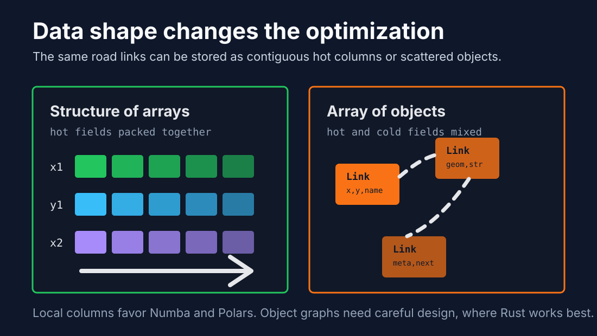
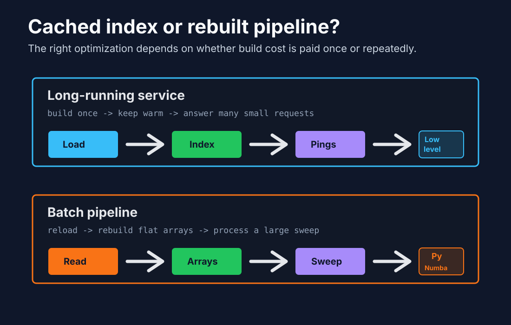

# What to Look at When Optimizing: Spatial Locality Before Tools

Optimization work often starts with the wrong question: "Should I use Rust, Numba, Polars, or another tool?" The better first question is: "What memory access pattern am I asking the CPU to execute?"

The [HL-Optimizer](https://github.com/muhammadaus/HL-Optimizer) benchmark made that distinction concrete. On Monaco OpenStreetMap data, a Rust KdTree was excellent for a long-running server that keeps its spatial index in memory. A Numba flat-grid pipeline was compelling for batch jobs that reload data frequently and scan large contiguous arrays. The deciding factor was not language identity. It was whether the workload benefited more from adaptive pruning or from simple, contiguous memory access.

That is the lens I would use before choosing any optimization stack.

## The Real Bottleneck Is Often Memory

Modern CPUs are extremely fast at arithmetic and surprisingly fragile around memory access. If the next value is already near the current value in cache, the CPU can keep moving. If every step follows a pointer to an unrelated heap allocation, execution waits on memory.

This is why two implementations with the same big-O complexity can behave very differently:

- A flat array walk can be predictable, vectorizable, and cache-friendly.
- A pointer-heavy tree can skip huge parts of the search space, but each step may jump to a different memory location.
- A Python loop over objects pays interpreter and object-layout overhead even if the algorithm is simple.
- A Polars or Numba operation over contiguous columns can keep most of the work in native code.

The important habit is to look past the library name and inspect the layout of the data being processed.



## Spatial Locality

Spatial locality means data that is used together is stored together. If a road segment's coordinates, bounding box, or grid-cell membership are stored in compact arrays, a batch query can stream through memory with fewer cache misses.

For example, this shape is usually friendly to batch processing:

```text
x1: [ ... contiguous float64 ... ]
y1: [ ... contiguous float64 ... ]
x2: [ ... contiguous float64 ... ]
y2: [ ... contiguous float64 ... ]
```

This shape can be harder on the CPU:

```text
Link {
    geometry: Vec<Point>,
    name: String,
    metadata: HashMap<...>,
    next: pointer
}
```

The second model may be more expressive. It may also be the right model for some systems. But it mixes hot data, cold metadata, and heap-owned structures. If the hot path only needs coordinates, carrying strings and nested objects through the same access path burns cache for no useful work.

## Pointer Chasing

Pointer chasing happens when each operation depends on loading an address from memory, then jumping somewhere else to continue. Trees, linked lists, hash maps, boxed objects, and object graphs can all introduce this pattern.

A KdTree is a useful example. Algorithmically, it can be excellent because it prunes the search space. For a single GPS ping against a cached city-tile index, the tree can descend into a small relevant region instead of checking many candidates. In the HL-Optimizer benchmark, that made the cached Rust path dramatically faster for one-query batches.

But pointer chasing has a cost. As the workload becomes a large batch over a larger region, a flat-grid approach can catch up because it does less clever navigation and more predictable scanning. In the benchmark, the Rust advantage narrowed as the link count grew, while the Numba flat-grid representation used much less memory per link.

The lesson is not "trees are bad" or "arrays are always better." The lesson is that adaptive indexing wins when pruning saves more work than pointer navigation costs. Flat arrays win when predictable memory access and parallel scans dominate.

## What the HL-Optimizer Results Suggest

The benchmark compared two broad approaches:

- Rust KdTree with PBF ingestion for a persistent real-time service.
- Numba flat-grid with GeoParquet ingestion for reload-heavy batch processing.

The key result was the decision boundary:

```text
Index cached across calls:
    low-level customization can win because build cost is amortized and single-query latency matters.

Index rebuilt per call:
    Python-native pipelines with flat arrays can win because rebuild cost and memory footprint dominate.
```

The same benchmark also showed that once data is loaded, the source format did not meaningfully affect query speed. PBF versus GeoParquet was an ingestion decision, not a matching-speed decision. That is another useful optimization habit: separate load-time concerns from hot-path concerns.



## When Low-Level Customization Benefits

Low-level customization is most valuable when you need tight control over latency, layout, and long-lived state.

Good fits include:

- Real-time services where the index is built once and reused for millions of calls.
- Low-latency request paths where a single query must return quickly.
- Workloads with adaptive data structures such as spatial trees, routing indexes, or compact custom caches.
- Systems where memory ownership, allocation behavior, and predictable tail latency matter.
- Cases where you can design the hot data layout deliberately instead of inheriting a generic object model.

Rust is not automatically fast because it is Rust. It becomes fast when it lets you make the hot path small: fewer allocations, tighter structs, explicit lifetimes, and data structures shaped around the query pattern.

For the map-matching case, a Rust service makes sense when it loads a region at startup, keeps the KdTree warm, and handles individual pings as they arrive. The tree build cost disappears into startup, while the per-query traversal remains extremely small.

## When Numba Benefits

Numba is strongest when the algorithm can be expressed as numeric loops over NumPy-style arrays.

Good fits include:

- Batch processing over many rows or many queries.
- Geometry, simulation, scoring, matching, or distance calculations that can be written over primitive numeric arrays.
- Workloads where Python object iteration is the bottleneck but the algorithm itself is not complex enough to justify a separate low-level service.
- Parallel loops where each record can be processed independently.

The practical rule is simple: if you can turn the hot path into arrays of numbers, Numba can remove much of the Python overhead while preserving a Python workflow.

This is exactly where a flat-grid spatial index can work well. A uniform grid may be less adaptive than a KdTree, but it can be represented as compact arrays and rebuilt cheaply. For a nightly job that reloads road links, processes hundreds of thousands of GPS points, and exits, that is often the right trade.

## When Polars Benefits

Polars helps when the optimization problem is primarily tabular: filtering, joining, grouping, sorting, aggregating, projecting columns, and moving less data through the pipeline.

Good fits include:

- ETL before or after the numeric hot path.
- Loading only relevant columns instead of whole records.
- Predicate pushdown from Parquet or GeoParquet.
- Grouped trip processing, time-window filtering, deduplication, and feature construction.
- Pipelines where memory pressure comes from wide dataframes or unnecessary intermediate copies.

Polars is useful because it encourages columnar thinking. Columnar execution is a locality win: the engine can operate on dense buffers of the same type instead of walking row objects full of mixed fields.

For spatial workloads, Polars may not replace the core nearest-neighbor calculation. It can still be a large part of the performance story by reducing the data that reaches that calculation and keeping the surrounding pipeline column-oriented.

## What to Inspect Before Optimizing

Before reaching for a faster tool, I would inspect these questions:

1. Is the hot path compute-bound or memory-bound?
2. Is data stored contiguously, or are we walking object graphs?
3. Are we repeatedly rebuilding an index that could be cached?
4. Are we loading columns or records that the hot path never uses?
5. Does the workload need single-query latency or bulk throughput?
6. Can the algorithm be expressed as array operations?
7. Is the data structure pruning enough work to justify its complexity?

Those questions usually narrow the tool choice naturally.

## The Practical Split

Use low-level customization when the service is long-lived, the index is reused, and latency matters. A systems language such as Rust lets you design the data structure around the request path and keep control over allocation and memory layout.

Use Numba when the expensive part is a numeric loop that can run over contiguous arrays. It is especially attractive for batch jobs where the index is cheap to rebuild and the workflow should remain Python-native.

Use Polars when the surrounding data movement is the bottleneck. It will not make pointer-heavy code magically local, but it can prevent the pipeline from creating that problem in the first place.

The deeper point is that optimization is not mainly about choosing the most powerful tool. It is about understanding what the CPU sees: nearby data, predictable loops, fewer allocations, and less pointer chasing. Once that is clear, Rust, Numba, and Polars each have an obvious place.
